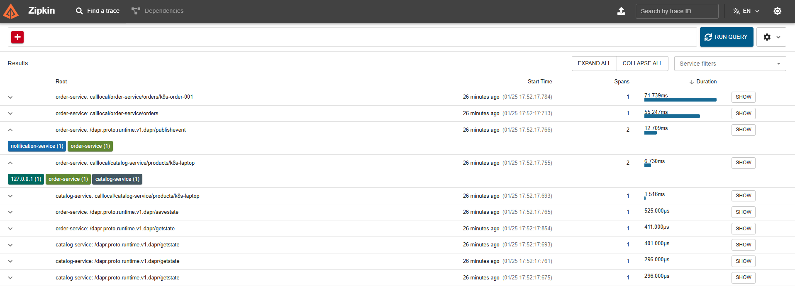
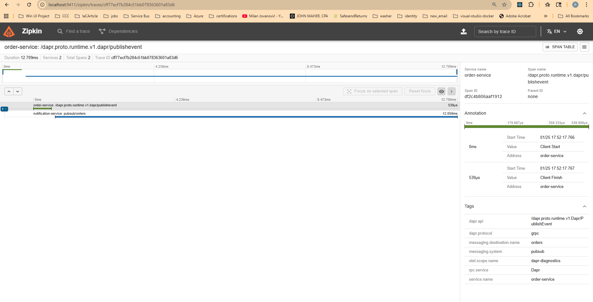
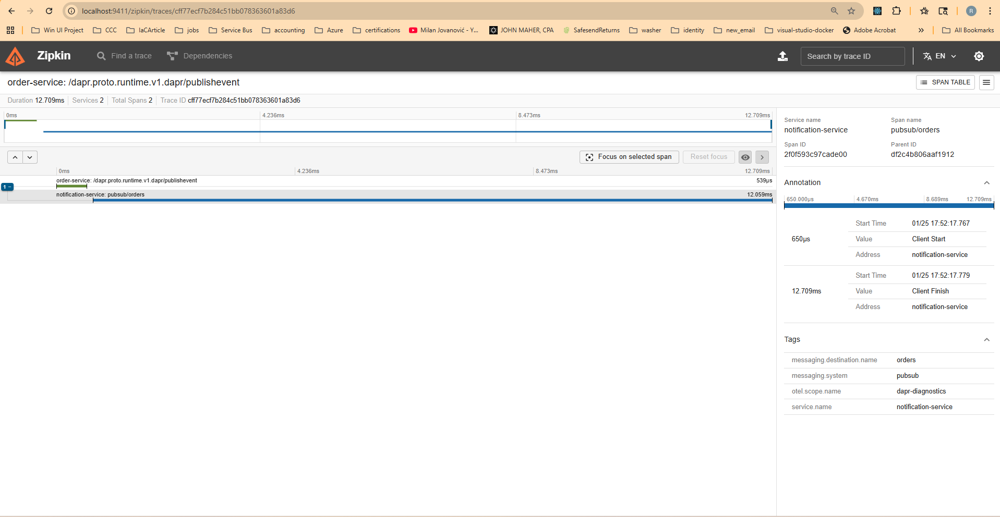
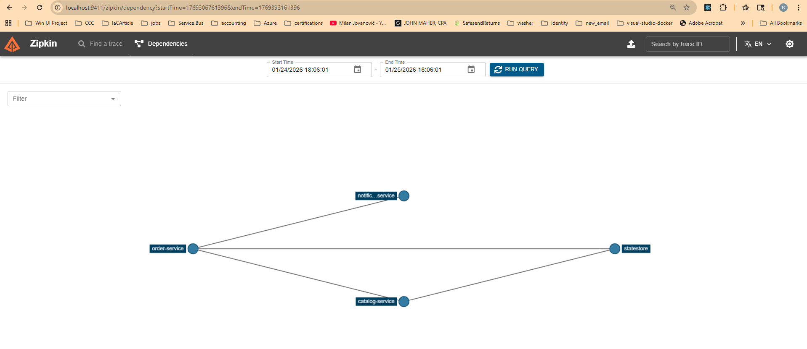
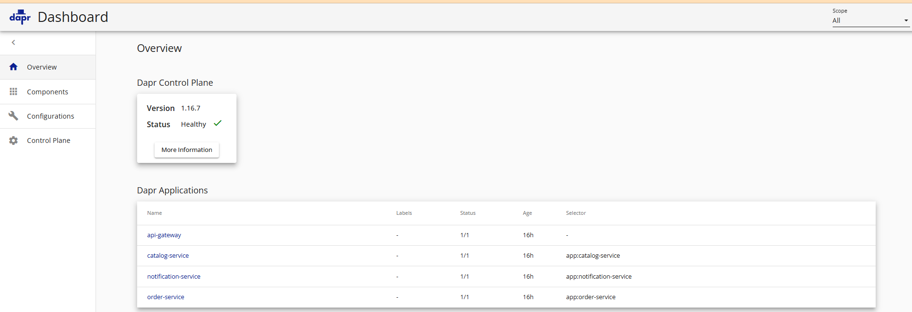
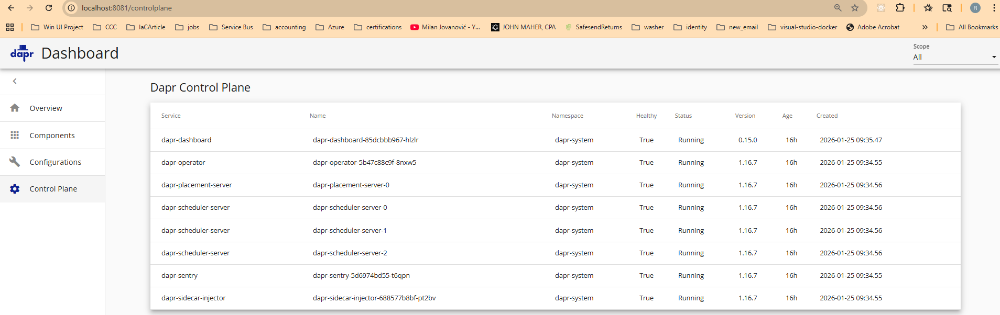
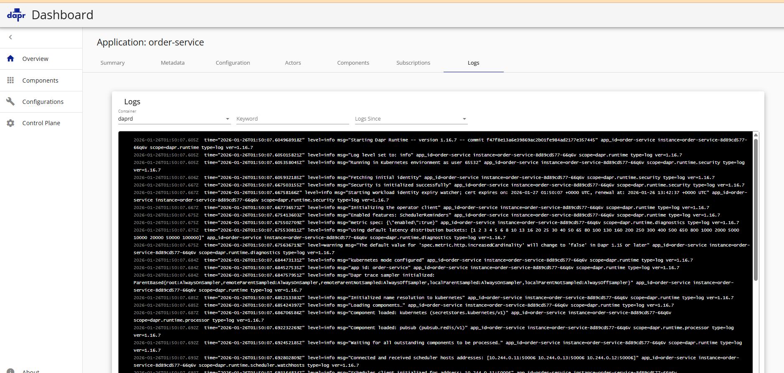
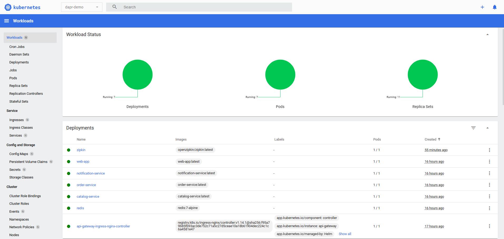
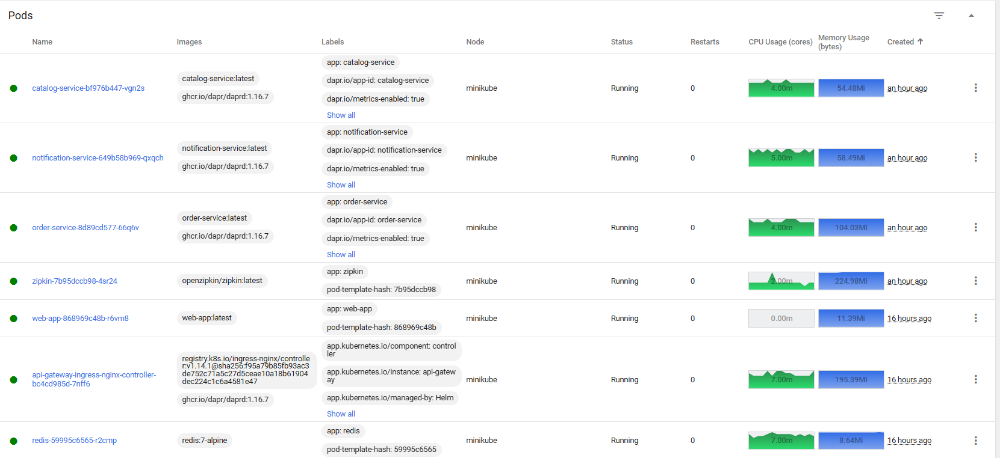
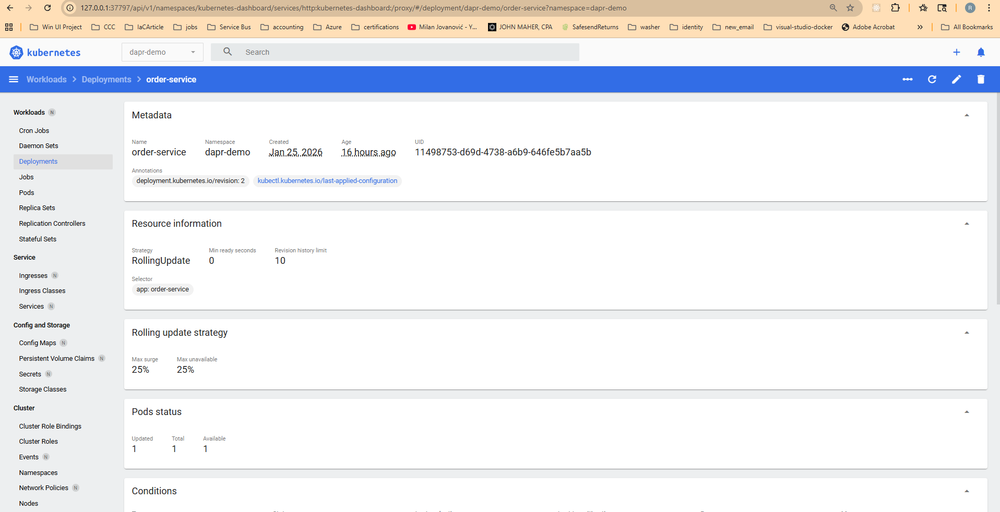

# Phase 4: Kubernetes with Observability

Deploy the Dapr microservices demo to Kubernetes with **Zipkin distributed tracing**. This phase adds observability to the Phase 3 deployment, allowing you to visualize request flows across all services.

> **Note**: These instructions use bash (Linux/macOS/WSL2). Run them from a Linux terminal.

See [ARCHITECTURE.md](ARCHITECTURE.md) for detailed explanations of automatic sidecar injection, the API gateway pattern, and distributed tracing.

## What's New in Phase 4?

| Feature | Description |
|---------|-------------|
| Zipkin | Distributed tracing UI at http://localhost:9411 |
| Dapr Tracing Config | All sidecars automatically send traces to Zipkin |
| 100% Sampling | Every request is traced (for demo purposes) |

## What You'll Learn

- Dapr tracing configuration
- Zipkin distributed tracing UI
- Visualizing request flows across microservices
- Debugging latency and errors in distributed systems

## Prerequisites

- Docker Desktop (running, WSL2 backend)
- minikube
- kubectl
- Helm
- Dapr CLI
- jq (for test scripts): `sudo apt-get install -y jq`

### Coming from Phase 3 (kubernetes/)?

If you already have Phase 3 running, you can use the same cluster. Just deploy Phase 4:

```bash
cd deployments/kubernetes-phase4-observability
./scripts/deploy-all.sh
```

The ingress controller will be upgraded with tracing enabled.

## Quick Start

### 1. Setup cluster (skip if already running from Phase 3)

**Starting fresh?** Clean up any previous setup first:

```bash
# Kill any existing port-forwards
pkill -f "kubectl port-forward" 2>/dev/null || true

# Full reset (recommended for clean start)
minikube delete

# Or just clean up the namespace (keeps cluster)
# kubectl delete namespace dapr-demo --ignore-not-found
```

Then setup:

```bash
cd deployments/kubernetes-phase4-observability
./scripts/setup-cluster.sh
```

This starts minikube, installs Dapr on Kubernetes, and configures nginx-ingress with a Dapr sidecar. The script waits for all components to be ready before completing.

This may take several minutes, especially the first time.

**Timeout or CrashLoopBackOff?** The ingress controller's Dapr sidecar may crash initially because it references a tracing config that doesn't exist until `deploy-all.sh` runs. This is expected. Continue with steps 2 and 3, then restart the ingress:

```bash
# After deploy-all.sh completes:
kubectl rollout restart deployment/api-gateway-ingress-nginx-controller -n dapr-demo

# Verify all pods are running (2/2 for services with sidecars)
kubectl get pods -n dapr-demo
```

### 2. Build images (skip if already built from Phase 3)

```bash
eval $(minikube docker-env)
./scripts/build-images.sh --with-frontend
```

### 3. Deploy services with tracing

```bash
./scripts/deploy-all.sh --with-frontend
```

This deploys all services with tracing enabled, plus Zipkin and the React web app.

### 4. Start port-forwards

```bash
# API Gateway (serves both web app and API)
kubectl port-forward -n dapr-demo svc/api-gateway-ingress-nginx-controller 8080:80 &

# Zipkin (distributed tracing UI)
kubectl port-forward -n dapr-demo svc/zipkin 9411:9411 &
```

### 5. Access the application

**Web UI (React app):** http://localhost:8080
- Browse product catalog, create orders
- Each action generates traces visible in Zipkin

**API (curl/scripts):**
```bash
./scripts/test-services.sh
```

### 6. View traces in Zipkin

Open http://localhost:9411 and click **"Run Query"** to see recent traces.

## Zipkin Walkthrough

The screenshots below show example data - your traces will look similar.

### Trace List

After running `test-services.sh`, you'll see a list of traces. Click the **chevron (∨)** to expand traces and see which services participated.



**What to look for:**

| Trace | Spans | Services | Pattern |
|-------|-------|----------|---------|
| `order-service: calllocal/catalog-service/...` | 2 | order-service, catalog-service | Service invocation |
| `order-service: /dapr.proto.runtime.v1.dapr/publishevent` | 2 | order-service, notification-service | Pub/sub |
| `catalog-service: /dapr.proto.runtime.v1.dapr/getstate` | 1 | catalog-service | State operation |

The colored tags (e.g., `notification-service (1)`) show which services handled spans in that trace.

Click **"SHOW"** on a trace with 2 spans to see the full flow.

### Trace Detail (Waterfall View)

The trace detail shows the parent-child relationship between spans:



**What you're seeing:**
- **Top bar**: Total trace duration (12.709ms)
- **First span** (blue): `order-service` publishing an event (539μs)
- **Second span** (green): `notification-service` receiving the event (12.059ms)
- The waterfall shows notification-service started after order-service published

### Span Detail

Click on a span to see detailed metadata:



**Useful tags:**
- `messaging.destination.name: orders` - The pub/sub topic
- `messaging.system: pubsub` - Dapr pub/sub
- `service.name: notification-service` - Which service handled it
- Timing annotations show exactly when the span started and finished

### Service Dependencies

Click **"Dependencies"** in the top nav to see the service graph:



This shows how services communicate:
- `order-service` → `notification-service` (pub/sub)
- `order-service` → `catalog-service` (service invocation)
- `order-service` → `statestore` (state operations)

## Dapr Dashboard Walkthrough

The Dapr dashboard provides a management view of your Dapr applications and control plane. Start it on a different port (8080 is used by the API gateway):

```bash
dapr dashboard -k -n dapr-demo -p 8081
```

Then open http://localhost:8081

### Overview

The overview shows all Dapr-enabled applications and their health status:



**What you're seeing:**
- **Dapr Control Plane**: Version and health status
- **Dapr Applications**: All services with Dapr sidecars (api-gateway, catalog-service, notification-service, order-service)
- **Status 1/1**: One replica running, one expected

### Control Plane

Click **"Control Plane"** to see the Dapr system components:



| Component | Purpose |
|-----------|---------|
| dapr-operator | Manages Dapr components and configurations |
| dapr-sidecar-injector | Injects daprd containers into pods |
| dapr-placement-server | Actor placement (for stateful actors) |
| dapr-scheduler-server | Job scheduling |
| dapr-sentry | Certificate authority for mTLS |
| dapr-dashboard | This web UI |

### Application Logs

Click on an application name, then the **"Logs"** tab to see sidecar logs:



**Note:** These are **sidecar (daprd) logs**, not application logs. You'll see:
- Component initialization
- Service registration
- Pub/sub subscriptions
- Tracing configuration

For application logs, use kubectl:
```bash
kubectl logs -f deployment/order-service -c order-service -n dapr-demo
```

## Minikube Dashboard Walkthrough

The minikube dashboard is a general-purpose Kubernetes UI for viewing workloads, pods, and cluster resources. Start it with:

```bash
minikube dashboard
```

This opens automatically in your browser.

> **Note:** Minikube is for **local development only**. Production Kubernetes deployments (Azure AKS, AWS EKS, Google GKE) have their own monitoring solutions like Azure Monitor, CloudWatch, or Stackdriver with more robust logging, alerting, and scaling capabilities.

### Select the Namespace

**Important:** Select **"dapr-demo"** from the namespace dropdown at the top. By default, minikube shows the "default" namespace which is empty.



### Kubernetes Concepts

| Concept | Description |
|---------|-------------|
| **Deployment** | Declares the desired state for your application (image, replicas, update strategy). Kubernetes ensures reality matches the declaration. |
| **Pod** | The smallest deployable unit. Contains one or more containers that share storage and network. Our services have 2 containers per pod: the app + Dapr sidecar. |
| **Replica Set** | Maintains a stable set of pod replicas. Created automatically by Deployments. Old replica sets (0/0 pods) remain for rollback capability. |

### Workloads Overview

The Workload Status shows health at a glance:
- **Deployments (7)**: zipkin, web-app, notification-service, order-service, catalog-service, redis, api-gateway
- **Pods (7)**: One pod per deployment (each with app + daprd sidecar containers)
- **Replica Sets (11)**: Active sets plus old revisions kept for rollback

### Pods View

Click **"Pods"** in the left nav to see all running pods with resource usage:



**What you're seeing:**
- Each pod shows **2 images**: your application + `ghcr.io/dapr/daprd` (the sidecar)
- **CPU/Memory graphs**: Real-time resource consumption
- **Status**: Running, Pending, or Failed
- **Restarts**: Non-zero indicates crashes (check logs)

### Deployment Detail

Click on a deployment name to see its configuration:



**Key information:**
- **Strategy: RollingUpdate** - Pods are updated gradually, not all at once
- **Pods status**: Updated/Total/Available counts
- **Selector**: Labels used to identify pods belonging to this deployment

## Dashboards

| Dashboard | Command | URL |
|-----------|---------|-----|
| Zipkin | `kubectl port-forward -n dapr-demo svc/zipkin 9411:9411` | http://localhost:9411 |
| Dapr | `dapr dashboard -k -n dapr-demo` | http://localhost:8080 |
| Minikube | `minikube dashboard` | Opens automatically |

## What Changed from Phase 3?

Compare the directories to see exactly what was added:

```bash
diff -r deployments/kubernetes deployments/kubernetes-phase4-observability
```

Key changes:
- **Added**: `manifests/10-zipkin.yaml` - Zipkin deployment
- **Added**: `manifests/03-components/tracing.yaml` - Dapr tracing configuration
- **Modified**: Service manifests - added `dapr.io/config: "tracing"` annotation
- **Modified**: `config/ingress-values.yaml` - added tracing to API gateway

## Optional: Web Frontend

```bash
./scripts/build-images.sh --with-frontend
./scripts/deploy-all.sh --with-frontend
```

Then open http://localhost:8080/ - traces will appear in Zipkin for each action.

## Infrastructure Swaps

Same as Phase 3 - infrastructure swaps still work:

```bash
./scripts/deploy-all.sh --pubsub rabbitmq
./scripts/deploy-all.sh --statestore mongodb
```

## Useful Commands

```bash
# View all pods (should include zipkin)
kubectl get pods -n dapr-demo

# View service logs
kubectl logs -f deployment/catalog-service -c catalog-service -n dapr-demo
kubectl logs -f deployment/notification-service -c notification-service -n dapr-demo

# View Dapr sidecar logs
kubectl logs -f deployment/catalog-service -c daprd -n dapr-demo
```

## Project Structure

```
deployments/kubernetes-phase4-observability/
├── config/
│   └── ingress-values.yaml       # + dapr.io/config: "tracing"
├── docs/
│   └── images/                   # Dashboard screenshots
│       ├── zipkin-trace-list.png
│       ├── zipkin-trace-detail.png
│       ├── zipkin-span-detail.png
│       ├── zipkin-dependencies.png
│       ├── dapr-dashboard-overview.png
│       ├── dapr-dashboard-control-plane.png
│       ├── dapr-dashboard-logs.png
│       ├── minikube-workloads.png
│       ├── minikube-pods.png
│       └── minikube-deployment-detail.png
├── manifests/
│   ├── 00-namespace.yaml
│   ├── 01-redis.yaml
│   ├── 02-rabbitmq.yaml
│   ├── 02-mongodb.yaml
│   ├── 03-components/
│   │   ├── statestore.yaml
│   │   ├── pubsub.yaml
│   │   ├── tracing.yaml          # NEW: Dapr tracing config
│   │   └── templates/
│   ├── 04-catalog-service.yaml   # + dapr.io/config: "tracing"
│   ├── 05-order-service.yaml     # + dapr.io/config: "tracing"
│   ├── 06-notification-service.yaml  # + dapr.io/config: "tracing"
│   ├── 08-web-app.yaml
│   ├── 09-ingress.yaml
│   └── 10-zipkin.yaml            # NEW: Zipkin deployment
├── scripts/
│   ├── setup-cluster.sh
│   ├── build-images.sh
│   ├── deploy-all.sh             # + deploys Zipkin
│   ├── cleanup.sh
│   └── test-services.sh
├── README.md
└── ARCHITECTURE.md
```

## Cleanup

**Continuing to Phase 5 (Workflow)?** Keep the cluster running.

**Done with Kubernetes?** Clean up resources:

```bash
./scripts/cleanup.sh      # Remove dapr-demo namespace resources
minikube stop             # Stop the cluster (preserves state)
minikube delete           # Full cleanup (removes cluster entirely)
```
