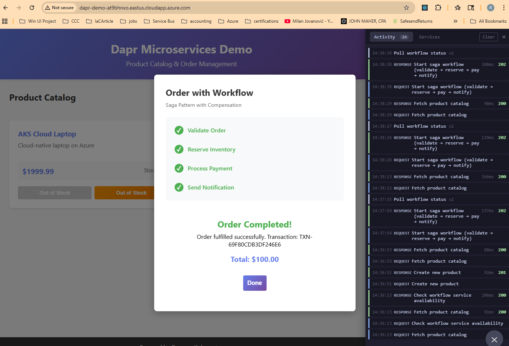
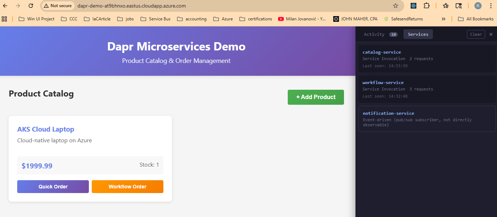
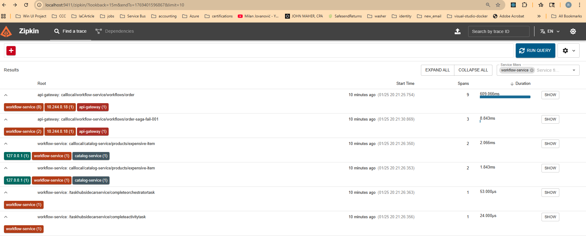
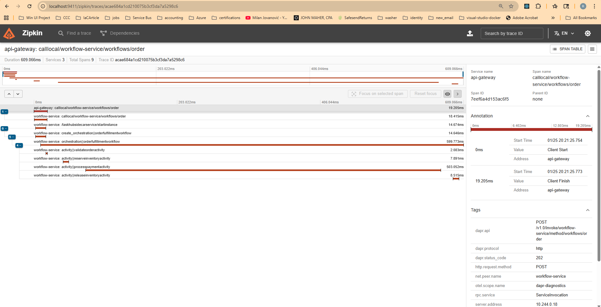
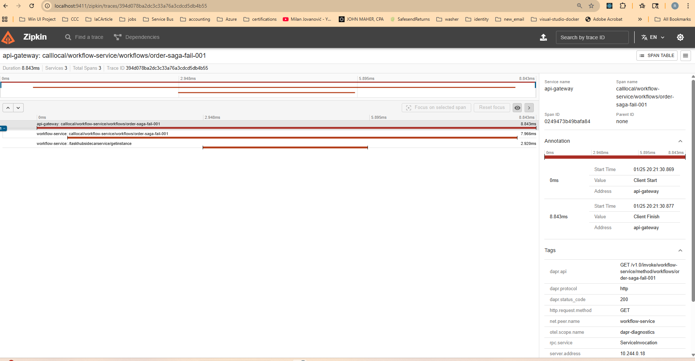

# Phase 5: Kubernetes with Dapr Workflow

Deploy the Dapr microservices demo to Kubernetes with **Dapr Workflow** for order orchestration using the **saga pattern**. This phase adds a .NET workflow service that coordinates multi-step transactions with automatic compensation on failure.

> **Note**: These instructions use bash (Linux/macOS/WSL2). Run them from a Linux terminal.

See [ARCHITECTURE.md](ARCHITECTURE.md) for detailed explanations of the saga pattern, workflow activities, and compensation logic.

## What's New in Phase 5?

| Feature | Description |
|---------|-------------|
| Dapr Workflow | .NET 8.0 service using Dapr.Workflow SDK |
| Saga Pattern | Multi-step transaction with compensation on failure |
| Order Orchestration | Validate → Reserve Inventory → Process Payment → Notify |
| Automatic Rollback | Failed payments trigger inventory release |

## What You'll Learn

- Dapr Workflow SDK for .NET
- Saga pattern for distributed transactions
- Compensation logic for rollback
- Workflow state management
- Distributed tracing of workflow execution

## Prerequisites

- Docker Desktop (running, WSL2 backend)
- minikube
- kubectl
- Helm
- Dapr CLI
- jq (for test scripts): `sudo apt-get install -y jq`
- .NET 8.0 SDK (optional, for local development only)

### Coming from Phase 4 (observability)?

If you already have Phase 4 running, you can use the same cluster. Just build and deploy Phase 5:

```bash
cd deployments/kubernetes-phase5-workflow
eval $(minikube docker-env)
./scripts/build-images.sh
./scripts/deploy-all.sh
```

## Quick Start

### 1. Setup cluster (skip if already running)

**Starting fresh?** Clean up any previous setup first:

```bash
# Kill any existing port-forwards
pkill -f "kubectl port-forward" 2>/dev/null || true

# Full reset (recommended for clean start)
minikube delete

# Or just clean up the namespace (keeps cluster)
# kubectl delete namespace dapr-demo --ignore-not-found
```

Then setup:

```bash
cd deployments/kubernetes-phase5-workflow
./scripts/setup-cluster.sh
```

This starts minikube, installs Dapr on Kubernetes, and configures nginx-ingress with a Dapr sidecar. The script waits for all components to be ready before completing.

This may take several minutes, especially the first time.

**Timeout or CrashLoopBackOff?** The ingress controller's Dapr sidecar may crash initially because it references a tracing config that doesn't exist until `deploy-all.sh` runs. This is expected. Continue with steps 2 and 3, then restart the ingress:

```bash
# After deploy-all.sh completes:
kubectl rollout restart deployment/api-gateway-ingress-nginx-controller -n dapr-demo

# Verify all pods are running (2/2 for services with sidecars)
kubectl get pods -n dapr-demo
```

### 2. Build images

```bash
eval $(minikube docker-env)
./scripts/build-images.sh --with-frontend
```

### 3. Deploy services

```bash
./scripts/deploy-all.sh --with-frontend
```

### 4. Start port-forward

```bash
kubectl port-forward -n dapr-demo svc/api-gateway-ingress-nginx-controller 8080:80 &
```

### 5. Access the application

**Web UI (React app):** http://localhost:8080
- Browse product catalog
- "Quick Order" - uses order-service directly
- "Workflow Order" - uses saga pattern with compensation

### Screenshots

#### Saga Workflow - Activity
Saga workflow execution with the activity log showing each Dapr call in real-time, including workflow-service polling.



#### Saga Workflow - Services
Services tab after workflow execution showing workflow-service alongside catalog and order services. The notification-service is noted as event-driven (pub/sub subscriber, not directly observable).



**API (curl/scripts):**
```bash
./scripts/test-workflow.sh
```

## Saga Pattern Workflow

The `OrderFulfillmentWorkflow` implements a 4-step saga with compensation:

```
┌─────────────────────────────────────────────────────────────────────────────┐
│                        Order Fulfillment Workflow                           │
├─────────────────────────────────────────────────────────────────────────────┤
│                                                                             │
│  Step 1: ValidateOrderActivity                                              │
│    └─ Check: orderId, productId, quantity > 0, customerEmail                │
│       └─ If invalid → Return "Failed" (no compensation needed)              │
│                                                                             │
│  Step 2: ReserveInventoryActivity                                           │
│    └─ GET catalog-service/products/{id}                                     │
│    └─ Check stock availability                                              │
│    └─ PUT catalog-service/products/{id} (decrement stock)                   │
│       └─ If failed → Return "Failed" (no compensation needed)               │
│                                                                             │
│  Step 3: ProcessPaymentActivity                                             │
│    └─ Simulate payment (fails if amount > $10,000)                          │
│       └─ If failed → COMPENSATE: ReleaseInventoryActivity                   │
│                      (PUT to restore stock)                                 │
│                      Return "Failed"                                        │
│                                                                             │
│  Step 4: NotifyCustomerActivity                                             │
│    └─ Publish to pub/sub "orders" topic                                     │
│    └─ Return "Completed"                                                    │
│                                                                             │
└─────────────────────────────────────────────────────────────────────────────┘
```

## API Endpoints

### Start a Workflow

```bash
curl -X POST http://localhost:8080/v1.0/invoke/workflow-service/method/workflows/order \
  -H 'Content-Type: application/json' \
  -d '{
    "orderId": "order-001",
    "productId": "laptop-001",
    "quantity": 2,
    "customerName": "John Doe",
    "customerEmail": "john@example.com"
  }'
```

**Response:**
```json
{
  "instanceId": "order-order-001",
  "orderId": "order-001",
  "status": "Scheduled",
  "message": "Order fulfillment workflow started"
}
```

### Check Workflow Status

```bash
curl http://localhost:8080/v1.0/invoke/workflow-service/method/workflows/order-order-001
```

**Response (Completed):**
```json
{
  "instanceId": "order-order-001",
  "status": "Completed",
  "output": {
    "orderId": "order-001",
    "status": "Completed",
    "message": "Order fulfilled successfully. Transaction: TXN-ABC123",
    "totalAmount": 1999.98
  }
}
```

**Response (Failed with Compensation):**
```json
{
  "instanceId": "order-order-001",
  "status": "Completed",
  "output": {
    "orderId": "order-001",
    "status": "Failed",
    "message": "Payment failed: Amount exceeds limit. Inventory has been released."
  }
}
```

## Testing Compensation

To see the saga compensation in action:

```bash
# 1. Create an expensive product (price > $10k triggers payment failure)
curl -X POST http://localhost:8080/v1.0/invoke/catalog-service/method/products \
  -H 'Content-Type: application/json' \
  -d '{"id":"expensive","name":"Expensive Item","price":15000.00,"stock":5}'

# 2. Check initial stock
curl http://localhost:8080/v1.0/invoke/catalog-service/method/products/expensive
# Stock: 5

# 3. Start workflow (will fail payment)
curl -X POST http://localhost:8080/v1.0/invoke/workflow-service/method/workflows/order \
  -H 'Content-Type: application/json' \
  -d '{"orderId":"fail-test","productId":"expensive","quantity":1,"customerName":"Test","customerEmail":"test@example.com"}'

# 4. Wait and check status
sleep 5
curl http://localhost:8080/v1.0/invoke/workflow-service/method/workflows/order-fail-test
# Status: Completed, Output.Status: Failed

# 5. Verify stock was restored (compensation worked!)
curl http://localhost:8080/v1.0/invoke/catalog-service/method/products/expensive
# Stock: 5 (restored from 4)
```

## Dashboards

| Dashboard | Command | URL |
|-----------|---------|-----|
| Zipkin | `kubectl port-forward -n dapr-demo svc/zipkin 9411:9411` | http://localhost:9411 |
| Dapr | `dapr dashboard -k -n dapr-demo -p 8081` | http://localhost:8081 |
| Minikube | `minikube dashboard` | Opens automatically |

## Workflow Traces in Zipkin

After running `test-workflow.sh`, filter by "workflow-service" to see saga execution traces.

### Trace List

The trace list shows both successful and failed workflow executions:



**What you're seeing:**
- **First trace** (9 spans, 609ms): Successful order workflow - all 4 activities completed
- **Second trace** (3 spans, 8ms): Failed workflow that triggered compensation
- **Other traces**: Individual service calls (catalog-service inventory checks)

### Saga Detail with Compensation

Click on a workflow trace to see the full saga execution with all activities:



**Activity breakdown:**
| Span | Description |
|------|-------------|
| `calllocal/workflow-service/workflows/order` | API gateway invoking workflow |
| `taskhubsidecarservice/startinstance` | Dapr starting the workflow instance |
| `create_orchestration\|orderfulfillmentworkflow` | Workflow orchestration starting |
| `orchestration\|orderfulfillmentworkflow` | Main workflow execution (longest span) |
| `activity\|validateorderactivity` | Step 1: Validating order fields |
| `activity\|reserveinventoryactivity` | Step 2: Reserving inventory |
| `activity\|processpaymentactivity` | Step 3: Processing payment |
| `activity\|releaseinventoryactivity` | **Compensation**: Releasing inventory (only on failure) |

The waterfall view shows the saga pattern in action - when payment fails, the compensation activity runs to restore inventory.

### Failed Workflow Trace

The failed workflow (`order-saga-fail-001`) shows a shorter trace - the workflow detected the payment failure and triggered compensation:



This trace shows the status check (GET) returning the failed workflow result. The actual compensation happened in the workflow execution trace above

## What Changed from Phase 4?

Compare the directories to see exactly what was added:

```bash
diff -r deployments/kubernetes-phase4-observability deployments/kubernetes-phase5-workflow
```

Key changes:
- **Added**: `services/workflow-service/` - New .NET 8.0 Dapr Workflow service
- **Added**: `manifests/07-workflow-service.yaml` - Kubernetes deployment
- **Modified**: `scripts/build-images.sh` - Builds workflow-service image
- **Modified**: `scripts/deploy-all.sh` - Deploys workflow-service
- **Added**: `scripts/test-workflow.sh` - Tests saga pattern

## Project Structure

```
deployments/kubernetes-phase5-workflow/
├── config/
│   └── ingress-values.yaml
├── manifests/
│   ├── 00-namespace.yaml
│   ├── 01-redis.yaml
│   ├── 02-rabbitmq.yaml
│   ├── 02-mongodb.yaml
│   ├── 03-components/
│   │   ├── statestore.yaml          # Used by workflow for state
│   │   ├── pubsub.yaml
│   │   ├── tracing.yaml
│   │   └── templates/
│   ├── 04-catalog-service.yaml
│   ├── 05-order-service.yaml
│   ├── 06-notification-service.yaml
│   ├── 07-workflow-service.yaml     # NEW: Dapr Workflow service
│   ├── 08-web-app.yaml
│   ├── 09-ingress.yaml
│   └── 10-zipkin.yaml
├── scripts/
│   ├── setup-cluster.sh
│   ├── build-images.sh              # + builds workflow-service
│   ├── deploy-all.sh                # + deploys workflow-service
│   ├── cleanup.sh
│   ├── test-services.sh
│   └── test-workflow.sh             # NEW: Tests saga pattern
├── README.md
└── ARCHITECTURE.md

services/workflow-service/            # NEW: .NET 8.0 Dapr Workflow
├── Dockerfile
├── WorkflowService.csproj
├── Program.cs
├── Models/
│   └── OrderModels.cs
├── Workflows/
│   └── OrderFulfillmentWorkflow.cs
└── Activities/
    ├── ValidateOrderActivity.cs
    ├── ReserveInventoryActivity.cs
    ├── ReleaseInventoryActivity.cs  # Compensation
    ├── ProcessPaymentActivity.cs
    └── NotifyCustomerActivity.cs
```

## Useful Commands

```bash
# View all pods (should include workflow-service)
kubectl get pods -n dapr-demo

# View workflow-service logs
kubectl logs -f deployment/workflow-service -c workflow-service -n dapr-demo

# View Dapr sidecar logs
kubectl logs -f deployment/workflow-service -c daprd -n dapr-demo

# View notification-service logs (to see pub/sub events)
kubectl logs -f deployment/notification-service -c notification-service -n dapr-demo
```

## Cleanup

**Continuing to Phase 6 (Cloud)?** Keep the cluster running.

**Done with Kubernetes?** Clean up resources:

```bash
./scripts/cleanup.sh      # Remove dapr-demo namespace resources
minikube stop             # Stop the cluster (preserves state)
minikube delete           # Full cleanup (removes cluster entirely)
```
