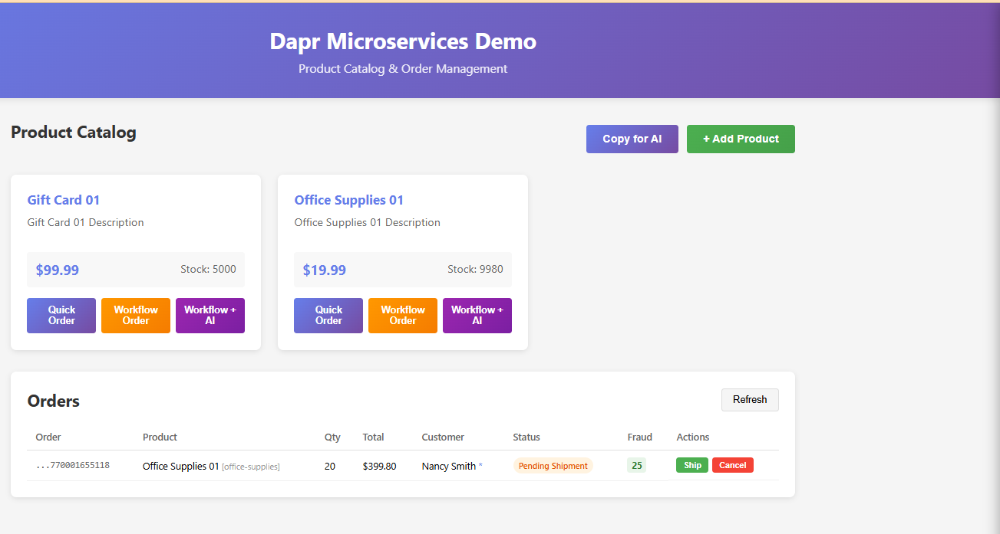
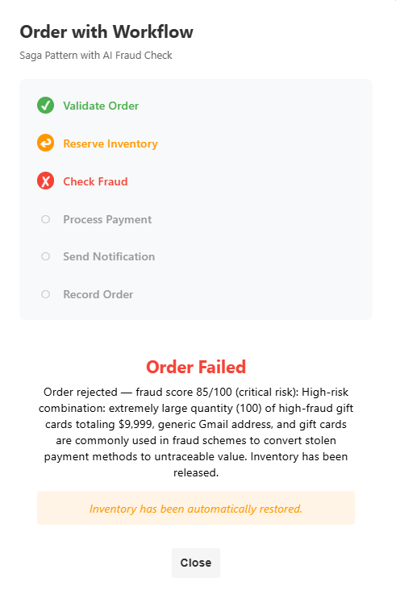
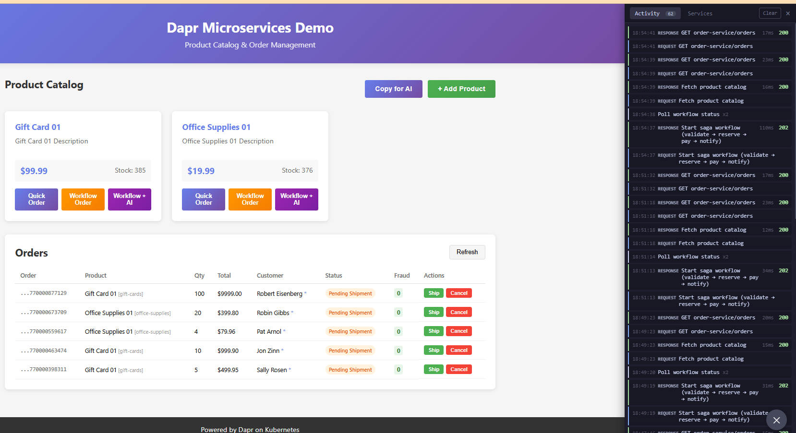

# Phase 7/7-A: AI Integration

Deploy the Dapr microservices demo with AI capabilities. This phase introduces AI in two steps:

- **Phase 7 (Manual):** "Copy for AI" button exports pending orders for fraud review in Claude Desktop
- **Phase 7-A (Fraud Check):** AI-powered fraud scoring in the order fulfillment workflow via Dapr Conversation API

See [ARCHITECTURE.md](ARCHITECTURE.md) for the updated workflow diagram.

## What's New?

| Feature | Phase | Description |
|---------|-------|-------------|
| "Copy for AI" button | 7 | Exports pending orders for fraud review in Claude |
| Order list endpoint | 7 | `GET /orders` returns all orders (new in order-service) |
| Ship/Cancel orders | 7 | `POST /orders/{id}/ship` and `/cancel` with inventory restoration |
| Orders panel | 7 | UI to view, ship, and cancel pending orders |
| Fraud scoring activity | 7-A | `CheckFraudActivity` returns fraud score 0-100 via Claude |
| Dapr Conversation API | 7-A | Provider-agnostic LLM calls (`conversation.anthropic` component) |
| Record order activity | 7-A | `RecordOrderActivity` saves workflow orders to state store |
| Updated saga display | 7-A | Frontend shows 6-step saga with fraud score display |

## What You'll Learn

- Adding an AI step to an existing deterministic workflow (saga pattern)
- Dapr Conversation API — provider-agnostic LLM abstraction (Claude, OpenAI, etc.)
- API key management via Kubernetes secrets + Dapr `secretKeyRef` (app never sees the key)
- Score-based AI assessment (0-100) rather than binary decisions — humans set the threshold
- Workflow compensation when fraud score exceeds threshold (inventory release)
- Feature detection pattern (frontend adapts to available services)

## Prerequisites

- Docker Desktop (running, WSL2 backend)
- minikube
- kubectl
- Helm
- Dapr CLI
- jq (for test scripts): `sudo apt-get install -y jq`
- A Claude account ([claude.ai](https://claude.ai)) or Claude Desktop app
- An Anthropic API key (for Phase 7-A)

### Coming from Phase 5 (Workflow)?

If you already have Phase 5 running, you can use the same cluster. Just rebuild and redeploy:

```bash
cd deployments/kubernetes-phase7-ai
eval $(minikube docker-env)
./scripts/build-images.sh --with-frontend
./scripts/deploy-all.sh --with-frontend
```

## Quick Start

### 1. Setup cluster (skip if already running)

**Starting fresh?** Clean up any previous setup first:

```bash
pkill -f "kubectl port-forward" 2>/dev/null || true
minikube delete
```

Then setup:

```bash
cd deployments/kubernetes-phase7-ai
./scripts/setup-cluster.sh
```

### 2. Build images

```bash
eval $(minikube docker-env)
./scripts/build-images.sh --with-frontend
```

### 3. Create API key secret (Phase 7-A)

The fraud check activity needs a Claude API key:

```bash
kubectl create secret generic anthropic-api-key \
  --from-literal=api-key=$ANTHROPIC_API_KEY \
  -n dapr-demo
```

If you skip this step, the fraud check will approve all orders by default (graceful degradation).

### 4. Deploy services

```bash
./scripts/deploy-all.sh --with-frontend
```

### 5. Start port-forward

```bash
kubectl port-forward -n dapr-demo svc/api-gateway-ingress-nginx-controller 8080:80 &
```

### 6. Access the application

Open http://localhost:8080

## Three Order Modes

Each product card has three buttons:

- **Quick Order** — Direct order, no workflow (same as Phase 3)
- **Workflow Order** (orange) — Saga pattern without AI fraud check. Orders land as "pending_shipment" for manual review via "Copy for AI"
- **Workflow + AI** (purple) — Saga pattern with AI fraud check. Claude scores the order before payment; high-risk orders are rejected automatically



## Phase 7-A: Automated Fraud Check (Workflow + AI)

The fraud check returns a score (0-100), not a binary yes/no. The workflow rejects orders scoring >= 80. Lower scores are approved but visible in the UI so humans can make the final call. Claude analyzes the full order context — product category, shipping address, order history, and purchasing velocity — to assess risk.

| Score | Risk Level | Workflow Action |
|-------|-----------|----------------|
| 0-39 | Low | Approved |
| 40-69 | Medium | Approved (flag for review) |
| 70-79 | High | Approved (flag for review) |
| 80-100 | Critical | Rejected (inventory released) |

### Rejected Order (High Fraud Score)

When Claude scores an order >= 80 (critical risk), the workflow stops at step 3, releases the reserved inventory, and shows the AI's reasoning:



Check logs to see Claude's fraud assessment:

```bash
kubectl logs -f deployment/workflow-service -c workflow-service -n dapr-demo
```

## Phase 7: Manual Fraud Review (Copy for AI)

Use **"Workflow Order"** (orange button) to place orders without automated fraud check. These land as "pending_shipment" and can be reviewed manually:

1. **Place workflow orders** — Build up pending orders using "Workflow Order"
2. **Click "Copy for AI"** — Formats all pending orders as a fraud review prompt, copies to clipboard
3. **Paste into Claude** — Open [claude.ai](https://claude.ai) or Claude Desktop
4. **Get fraud assessments** — Claude scores each order 0-100 with reasoning
5. **Ship or Cancel** — Return to the app and act on Claude's advice



## Testing

```bash
# Run service tests
./scripts/test-services.sh

# Test the order list endpoint directly
curl -s http://localhost:8080/v1.0/invoke/order-service/method/orders | jq

# Test workflow with fraud check
./scripts/test-workflow.sh
```

## Phase 3-A/3-B: Infrastructure Swaps

These still work:

```bash
./scripts/deploy-all.sh --with-frontend --pubsub rabbitmq
./scripts/deploy-all.sh --with-frontend --statestore mongodb
```

## Dashboards

| Dashboard | Command | URL |
|-----------|---------|-----|
| Zipkin | `kubectl port-forward -n dapr-demo svc/zipkin 9411:9411` | http://localhost:9411 |
| Dapr | `dapr dashboard -k -n dapr-demo -p 8081` | http://localhost:8081 |
| Minikube | `minikube dashboard` | Opens automatically |

## Project Structure

```
deployments/kubernetes-phase7-ai/
├── config/
│   └── ingress-values.yaml
├── manifests/
│   ├── 00-namespace.yaml
│   ├── 01-redis.yaml
│   ├── 02-rabbitmq.yaml
│   ├── 02-mongodb.yaml
│   ├── 03-components/
│   │   ├── statestore.yaml
│   │   ├── pubsub.yaml
│   │   ├── tracing.yaml
│   │   ├── conversation.yaml        # Anthropic LLM via Dapr Conversation API
│   │   └── templates/
│   ├── 04-catalog-service.yaml
│   ├── 05-order-service.yaml         # Updated: record/ship/cancel endpoints
│   ├── 06-notification-service.yaml
│   ├── 07-workflow-service.yaml      # Updated: fraud scoring + RecordOrderActivity
│   ├── 08-web-app.yaml               # Updated: OrdersPanel + fraud review export
│   ├── 09-ingress.yaml
│   └── 10-zipkin.yaml
├── scripts/
│   ├── setup-cluster.sh
│   ├── build-images.sh
│   ├── deploy-all.sh
│   ├── cleanup.sh
│   ├── test-services.sh
│   └── test-workflow.sh
├── README.md
└── ARCHITECTURE.md
```

## Useful Commands

```bash
# View all pods
kubectl get pods -n dapr-demo

# View workflow-service logs (see fraud check reasoning from Claude)
kubectl logs -f deployment/workflow-service -c workflow-service -n dapr-demo

# View order-service logs
kubectl logs -f deployment/order-service -c order-service -n dapr-demo
```

## Cleanup

```bash
./scripts/cleanup.sh
minikube stop
minikube delete
```
