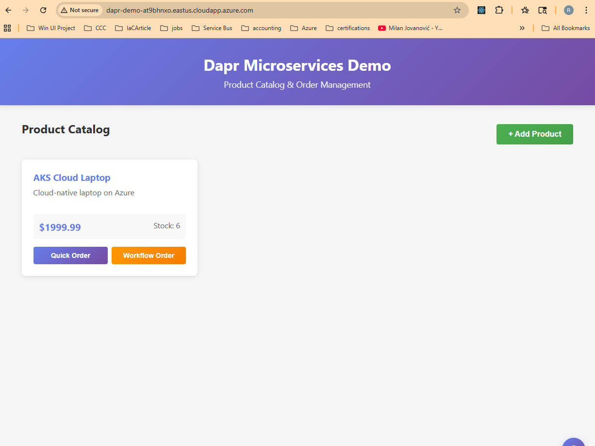
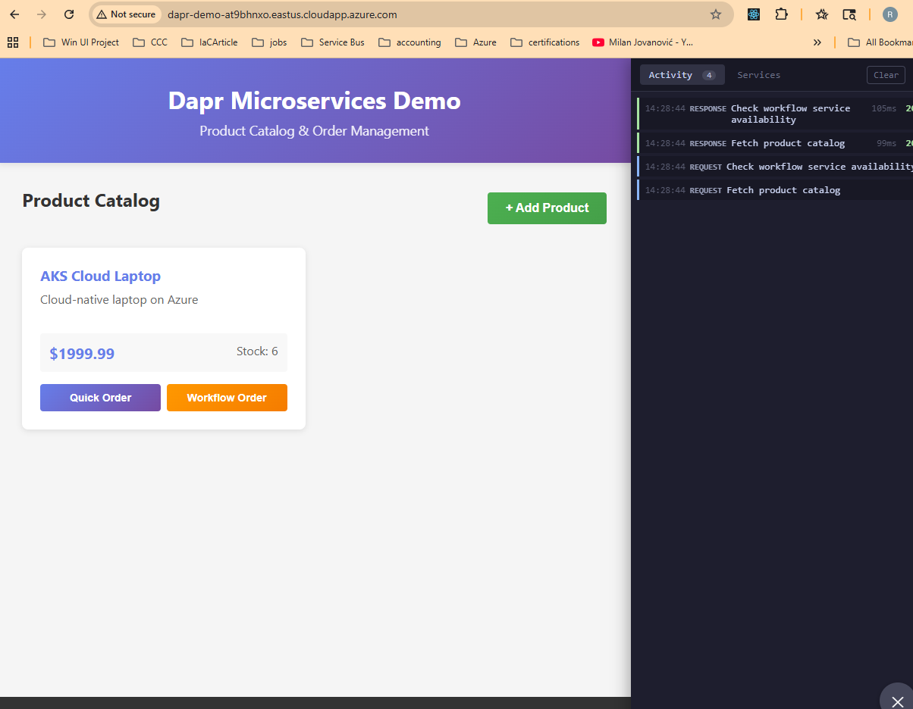
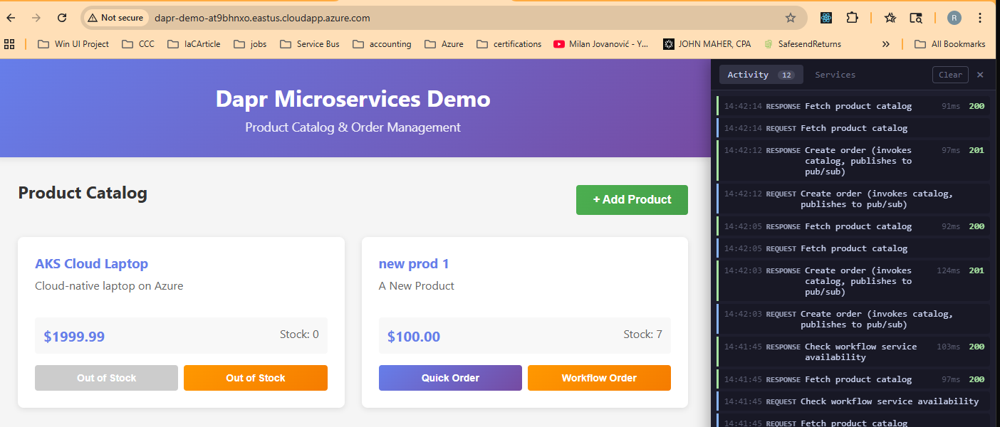

# Kubernetes Deployment

Deploy the Dapr microservices demo to Kubernetes using minikube.

> **Note**: These instructions use bash (Linux/macOS/WSL2). Run them from a Linux terminal.

See [ARCHITECTURE.md](ARCHITECTURE.md) for detailed explanations of automatic sidecar injection, the API gateway pattern, and how this differs from Docker Compose.

## What's Different from Docker Compose?

| Aspect | Docker Compose | Kubernetes |
|--------|----------------|------------|
| Sidecar management | Explicit containers | Auto-injected via annotations |
| Service discovery | Placement service | Dapr + K8s DNS |
| API gateway | N/A | NGINX Ingress with Dapr sidecar |
| Dashboard | Not available | `dapr dashboard -k` works |
| Scaling | Manual | `kubectl scale` |

## Prerequisites

- Docker Desktop (running, WSL2 backend)
- minikube
- kubectl
- Helm
- Dapr CLI
- jq (for test scripts): `sudo apt-get install -y jq`

### Coming from Docker Compose (Phase 2)?

```bash
cd deployments/docker
docker-compose down -v --rmi local
```

## Quick Start

### 1. Setup cluster

**Starting fresh?** Clean up any previous setup first:

```bash
# Kill any existing port-forwards
pkill -f "kubectl port-forward" 2>/dev/null || true

# Full reset (recommended for clean start)
minikube delete

# Or just clean up the namespace (keeps cluster)
# kubectl delete namespace dapr-demo --ignore-not-found
```

Then setup:

```bash
cd deployments/kubernetes
./scripts/setup-cluster.sh
```

This starts minikube, installs Dapr on Kubernetes, and configures nginx-ingress with a Dapr sidecar. The script waits for all components to be ready before completing.

This may take several minutes, especially the first time.

**Timeout or CrashLoopBackOff?** The ingress controller's Dapr sidecar may crash initially because it references a tracing config that doesn't exist until `deploy-all.sh` runs. This is expected. Continue with steps 2 and 3, then restart the ingress:

```bash
# After deploy-all.sh completes:
kubectl rollout restart deployment/api-gateway-ingress-nginx-controller -n dapr-demo

# Verify all pods are running (2/2 for services with sidecars)
kubectl get pods -n dapr-demo
``` When complete, you'll see:
```
Next steps:
  1. eval $(minikube docker-env)
  2. ./scripts/build-images.sh
  3. ./scripts/deploy-all.sh

Dashboards:
  Minikube: minikube dashboard
  Dapr:     dapr dashboard -k -n dapr-demo
```


### 2. Build images

```bash
eval $(minikube docker-env)
./scripts/build-images.sh
```

This builds the service images in minikube's Docker environment. When complete, you'll see:
```
Images built:
catalog-service:latest
notification-service:latest
order-service:latest

Next step: ./scripts/deploy-all.sh
```

### 3. Deploy services

```bash
./scripts/deploy-all.sh
```

When complete, you'll see:
```
Deployment Complete!
=========================================

Configuration:
  Pub/Sub:     redis
  State Store: redis
  Frontend:    false

Access:
  kubectl port-forward -n dapr-demo svc/api-gateway-ingress-nginx-controller 8080:80

Test: ./scripts/test-services.sh
```

### 4. Test

```bash
# Start port-forward (in background or separate terminal)
kubectl port-forward -n dapr-demo svc/api-gateway-ingress-nginx-controller 8080:80 &

# Run tests
./scripts/test-services.sh
```

The test exercises all 3 Dapr building blocks through the API gateway. When complete:
```
Test Complete!
=========================================

What just happened:
1. Product created in Catalog Service (Dapr State Management)
2. Order Service called Catalog via Dapr Service Invocation
3. Order Service published event via Dapr Pub/Sub
4. Notification Service received event via Dapr Pub/Sub
5. Order saved to state store via Dapr State Management

All 3 Dapr building blocks demonstrated through the API gateway!
```

To verify the notification was received:
```bash
kubectl logs deployment/notification-service -c notification-service -n dapr-demo
```

## Optional: Web Frontend

Want a UI instead of curl commands? Add the React web application:

```bash
./scripts/build-images.sh --with-frontend   # Build the web-app image
./scripts/deploy-all.sh --with-frontend     # Add web-app to deployment
```

Then open http://localhost:8080/ (with port-forward running).

### Screenshots

#### Product Catalog


#### Status Panel - Activity Log
Click the purple button in the bottom-right to open the status panel. Shows all Dapr service invocations with timestamps, response times, and HTTP status codes.



#### Quick Order - Activity
Multiple Quick Orders showing catalog-service and order-service invocations. Products go out of stock as orders are placed.


#### Quick Order - Services
Services tab showing detected Dapr services with request counts.



## Phase 3-A: Switch Pub/Sub to RabbitMQ

```bash
./scripts/deploy-all.sh --pubsub rabbitmq
./scripts/test-services.sh
```

## Phase 3-B: Switch State Store to MongoDB

```bash
./scripts/deploy-all.sh --statestore mongodb
./scripts/test-services.sh
```

## Combined Infrastructure Swap

```bash
./scripts/deploy-all.sh --pubsub rabbitmq --statestore mongodb
./scripts/test-services.sh
```

## Useful Commands

```bash
# View all pods
kubectl get pods -n dapr-demo

# View service logs
kubectl logs -f deployment/catalog-service -c catalog-service -n dapr-demo
kubectl logs -f deployment/notification-service -c notification-service -n dapr-demo

# View Dapr sidecar logs
kubectl logs -f deployment/catalog-service -c daprd -n dapr-demo

# Dapr dashboard
dapr dashboard -k -n dapr-demo

# Minikube dashboard
minikube dashboard
```

## Project Structure

```
deployments/kubernetes/
├── config/
│   └── ingress-values.yaml       # Helm values for nginx-ingress + Dapr
├── manifests/
│   ├── 00-namespace.yaml
│   ├── 01-redis.yaml
│   ├── 02-rabbitmq.yaml          # Phase 3-A
│   ├── 02-mongodb.yaml           # Phase 3-B
│   ├── 03-components/
│   │   ├── statestore.yaml
│   │   ├── pubsub.yaml
│   │   └── templates/            # Swap templates
│   ├── 04-catalog-service.yaml
│   ├── 05-order-service.yaml
│   ├── 06-notification-service.yaml
│   ├── 08-web-app.yaml           # Optional
│   └── 09-ingress.yaml
├── scripts/
│   ├── setup-cluster.sh
│   ├── build-images.sh
│   ├── deploy-all.sh
│   ├── cleanup.sh
│   └── test-services.sh
├── README.md
└── ARCHITECTURE.md
```

## Cleanup

**Continuing to Phase 4 (Observability)?** Keep the cluster running - Phase 4 builds on this deployment.

**Not continuing with monitoring and other Kubernetes steps?** Clean up resources:

```bash
./scripts/cleanup.sh      # Remove dapr-demo namespace resources
minikube stop             # Stop the cluster (preserves state)
minikube delete           # Full cleanup (removes cluster entirely)
```
